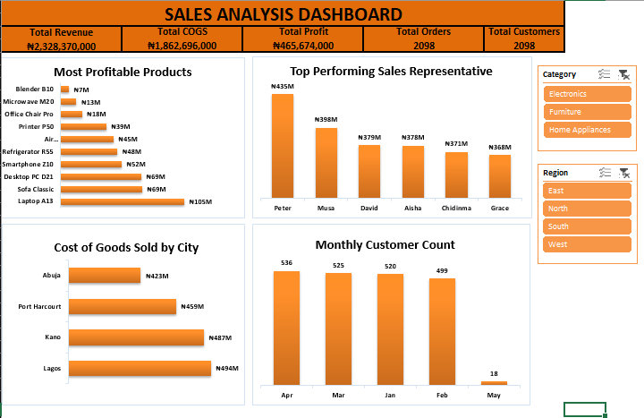

# Excel Data Analysis Project

A comprehensive data analysis workbook featuring data cleaning, pivot table aggregations, dynamic formulas, and interactive dashboard visuals.

---

## 📊 Dashboard Preview

---

## 🔑 Key Highlights
* **Data Cleaning & Preparation**: Standardized raw data, removed duplicates, and validated data types.
* **Analysis & Modeling**: Utilized advanced formulas (`XLOOKUP`, `INDEX/MATCH`, `SUMIFS`) and Pivot Tables.
* **Visualization**: Interactive charts and summary KPI scorecards with slicers.
*

