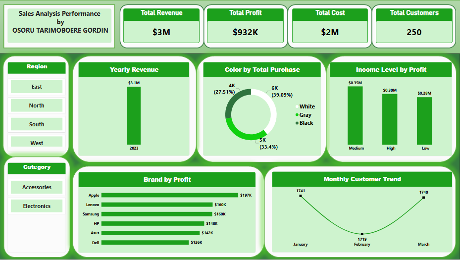

# Executive Sales & Customer Performance Dashboard

An interactive Power BI analytics dashboard analyzing revenue, profitability, and customer acquisition metrics across product lines and regions.

---

## 📊 Dashboard Preview

---

## 🔑 Key Performance Indicators (KPIs)
* **Total Revenue**: $3.11M
* **Total Cost**: $2.17M
* **Total Profit**: $931.9K
* **Total Customers**: 250

---

## 🛠️ Key Technical Implementations
* **Dynamic DAX Measures**: Formulated custom `SUMX` measures for revenue and cost calculations to treat `SalesAmount` as unit price in alignment with project benchmarks.
* **Data Modeling**: Built a validated One-to-Many (1:*) star schema linking customer profiles to sales transactions.
* **Timeline Separation**: Mapped transactional KPIs to `SaleDate` (2023) and acquisition cohorts to `SignupDate` (2020–2022).
* **Interactivity**: Embedded dynamic tile slicers for Category and Region filtering.
*
